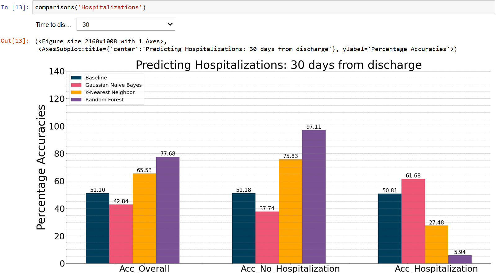
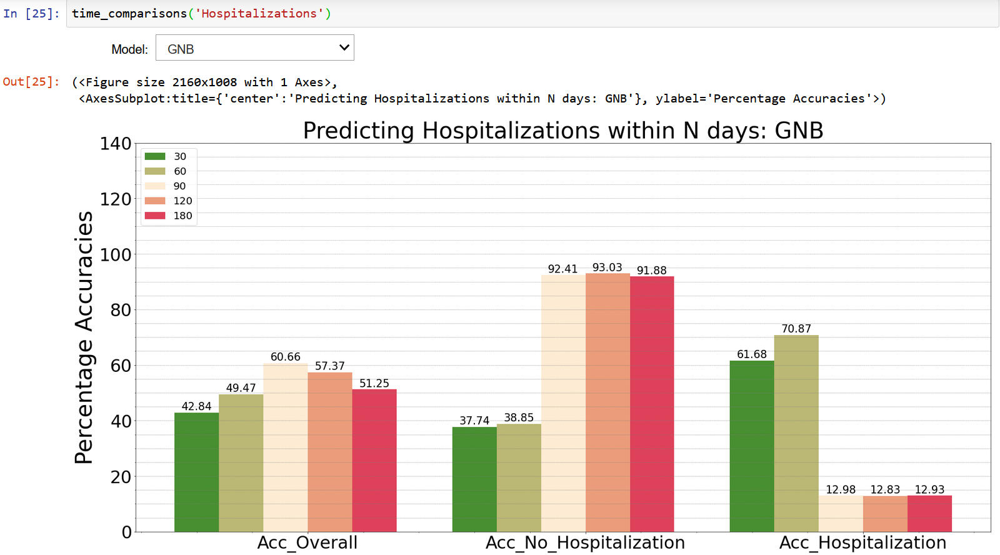
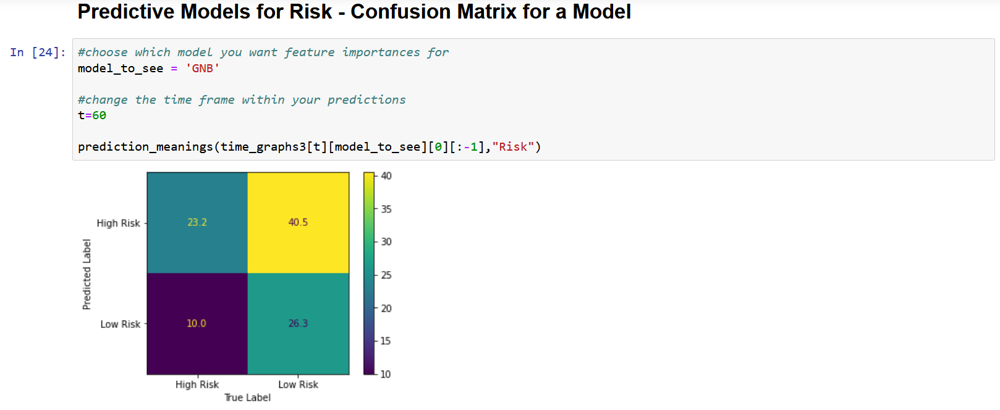
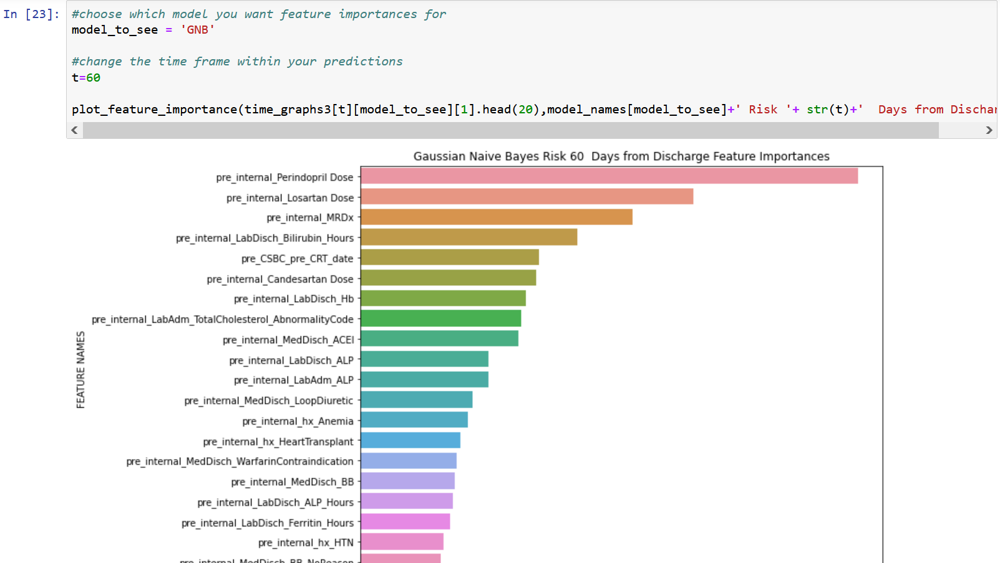
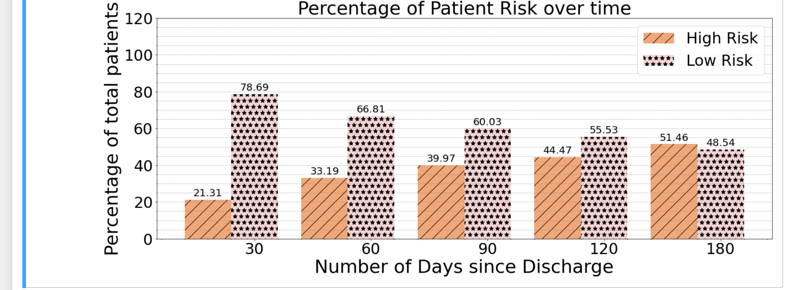

# heart-failure-prognosticator
Trying out Predictive Models for Heart Failure

## Project Overview
Vancouver General Hospital (VGH) offers a full range of specialized emergency health care services to BC residents, including cardiology. It is the largest facility in the Vancouver Hospital and Health Sciences Centre group of medical facilities.  In 2019, Vancouver Coastal Health (VCH) and Providence Health Care created a data repository of patients with a primary diagnosis of heart failure. The repository has allowed the examination of unplanned hospitalizations to one of three hospitals across Vancouver: St. Paul’s Hospital, Mount Saint Joseph Hospital and Vancouver General Hospital, from January 2017 to December 2018 and includes data relating to comorbidities of heart failure, length of stay during admission, medication and device therapies. The resulting outcomes are a product of a collaboration between Decision Support and the Regional Heart Failure Program. The primary goal is to create a comprehensive heart failure audit tool to better understand, support, and plan patient care.

Aligned with the goals of the Heart Failure Patient Audit, VGH cardiologists sought to demonstrate the feasibility of developing a machine-learning (ML) model for predicting the future risk profile of individual heart failure patients based on their medical history.

Together with VGH, UBC Cloud Innovation Centre (CIC) developed ML models to enable practitioners to predict four primary patient outcomes, including death within N days from first discharge, re-hospitalization within N days post-initial discharge from the hospital, ‘risk’ defined as either death or rehospitalization within N days and finally the number of potential hospitalizations.

## Visualization Interface

### Comparing ML Algorithms

### Comparisons over Time

### Confusion Matrix

### Feature Importance

## User Guide

### Data Description Files
There are 2 excel files (.xslx). The first 'HF_Audit_Dataset' provides a breakdown of the type of data used. The other file, 'Columns_Missing_Data' is imported by the code and provides a reference of column names and the specific imputation technique used during training.

### Notebooks
This repository consists of 6 notebook files (.ipynb). Their purpose is describes as follows:

* data_preprocessing: Pre-Process some of the patient data (eg. Combine TroponinI and TroponinT,
* Train_Hospitalizations_Classifier: Train models for the classification of re-hospitalizations within N days.
* Train_Hospitalizations_Regression: Train models for the task of regression to predict the number of hospitalizations of a patient.
* Train_Death: Train models for the task of classification of death within N days.
* Train_Risk: Train models for the task of classification of Risk (defined as either death or re-hospitalizations) within N days.
* Visualize_Results: Visualize Results from models that have been trained and results saved in /results/

### Data Pre-Processing
The first step of the pipeline involves pre-processing the medical data we received from VCH such as normalizing ACE inhibitor and Beta-Blocker doses and removing duplicate entries in the data (if any).

The notebook 'data_preprocessing.ipynb' takes in the raw data and outputs a processed version of the data.

### Training Models
To train models, one simply has to uncomment the cells relevant to the specific model that one wants to train. In the remainder of this section, we describe what the notebooks do at a high-level while in-line comments in the code provide more detail into the actual code.

For the classifiers, we have a hyper-parameter called 'days_to_check' which contains the array of values of N over which we want to train our models. For our project we desalt with prediction tasks over 30, 60, 90, 120, 180 days. For the regression model, we don't have this parameter as we are predicting the number of hospitalizations through regression as opposed to a binary outcome within N days.

After loading data, we decide which features are allotted to the different imputation techniques that we perform in our training loop.
We do this by loading a spreadsheet which contains a list of column names and the type of imputation we would perform on it.

To prepare our data for training, we perform some preliminary tasks. First, we fuse the values of B-type Natriuretic peptides with N-terminal B-type Natriuretic peptide, and the values of TroponinI with TroponinT as patients usually have values of one or the other.
Second, we extend our features by including the specific day/month of admission or discharge as a feature in our dataset.
Third, we prepare our variables for prediction from the data, respectively death, hospitalization and risk within N days from discharge, where N loops over the values of the hyper-parameter chosen earlier.

Before training, it is useful to have a visualization of the class distributions to get an understand of class imbalances. We provide a block of code that does this.

To train the models, we define functions to - train and test models and return the results; read the results and output accuracy metrics; use dynamic thresholds (optional) on the results for more nuanced classification tasks.

For each model, there is a block of code that deals with training the respective model which is commented by default.
The results are then outputted to a /results/ folder

### Visualizing Results
To visualize results, we create a notebook that lets you interactively visualize, for each outcome, the following graphs:

* A comparison between different ML algorithms for a particular value of N
* A comparison between different values of N for a particular ML algorithms
* Feature Importances for a particular model
* Confusion Matrices for a particular model

## License

This project is distributed under [MIT License](https://github.com/UBC-CIC/Sea-Around-Us/blob/main/LICENSE).
